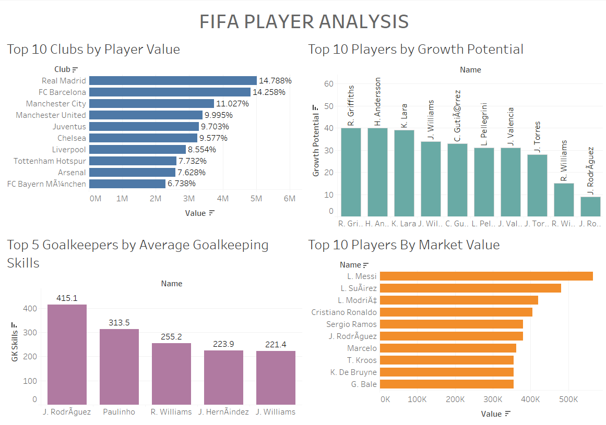
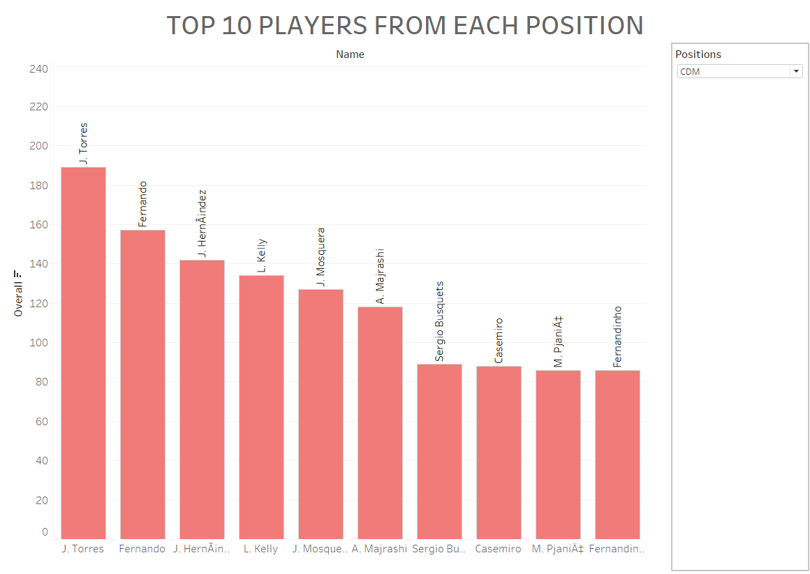

# FIFA Dataset Visualization using Tableau

## Introduction to FIFA
FIFA is one of the most popular football video games developed by EA Sports. It simulates real-life football matches and allows players to control football teams composed of real-life players. Each player in the game has attributes that affect their performance on the virtual pitch, such as speed, shooting accuracy, and defensive skills. These attributes are quantified in a dataset, which provides a wealth of information that can be analyzed to gain insights into player and team performance.

## Understanding the Fifa19 Dataset
The Fifa19 dataset contains detailed information about football players featured in the FIFA 19 video game. The dataset includes attributes such as:

**Name:** The player's name.

**Age:** The player's age.

**Nationality:** The player's nationality.

**Overall:** The player's overall rating.

**Potential:** The player's potential rating.

**Club:** The club the player is affiliated with.

**Value:** The player's market value.

**Position:** The player's primary playing position.

**Various Skills:** Specific attributes related to the player's abilities, such as goalkeeping skills (GK Diving, GK Handling, etc.) and field skills (Ball Control, Crossing, etc.).

## Tasks
1. **Top 10 Clubs by Player Value**

* Create a chart that highlights the top 10 clubs based on the highest overall value of their players.

* Display the percentage share of each club within this top 10 group.

2. **Top 10 Players by Market Value**

* Develop a chart showcasing the top 10 players with the highest market value.

* Include their overall scores and enhance the chart with tooltips that reveal each player's age, club, and nationality.

3. **Top 10 Players by Growth Potential**
* Identify players with the greatest growth potential by creating a calculated field that determines the difference between a player's current overall rating and their potential rating.

* Display the top 10 players based on this growth potential criterion and set the criteria for age as from 16 to 20 as the teams would like to focus on young players.

4. **Top 5 Goalkeepers by Average Goalkeeping Skills**
* Calculate the average of various goalkeeping skills to find the top 5 goalkeepers.

* Use columns such as [GK Diving], [GK Handling], [GK Kicking], [GK Positioning], [GK Reflexes], [Ball Control], [Crossing], [Jumping], [Long Passing], and [Long Shots].
Rank the goalkeepers accordingly and display the results.

5. **Top 10 Players from each position:** Your objective is to create an interactive dashboard in Tableau that allows users to select a position and view the top 10 players for that position based on their overall rating. Create a parameter that enables the selection of different player positions. Develop a calculated field to filter players based on the selected position. Create a ranking field to rank players by their overall rating within the selected position. Filter the data to show only the top 10 players for the selected position. Design a bar chart to display these top 10 players, including their names and overall ratings. Enhance the chart with tooltips that show additional player details such as club, nationality, and age. Assemble these components into a cohesive and interactive dashboard that dynamically updates based on the selected position.

6. **Create a Dashboard:** Assemble the four charts into a single, cohesive dashboard. Ensure that the dashboard is interactive and visually appealing, providing clear and insightful information at a glance.

